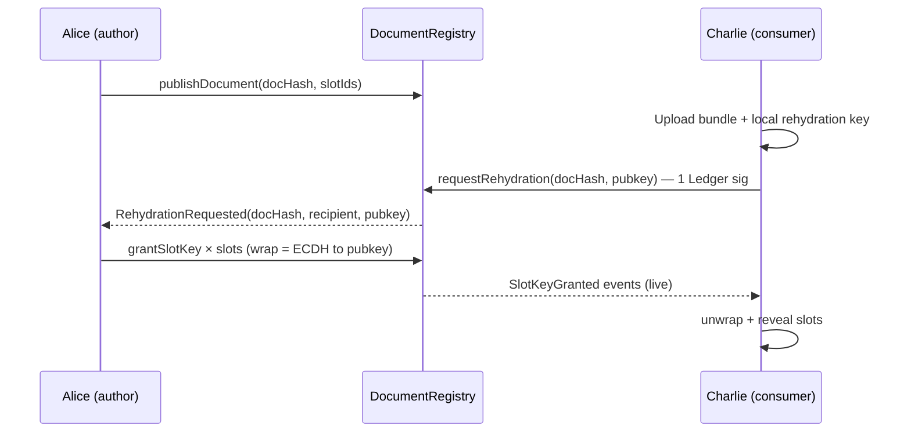

# Presentation / Deck Outline — ETHOnline 2026

Continuity track. Prize picks: **ENS · Ledger · World**.

**G0:** *Redact on your machine; authorized wallets rehydrate only the fields they’re allowed to see.*

Use:
- **Core (1–8)** — 4-minute video + default judging. ≤4 bullets/slide. Demo > slides.
- **Optional A / B / C** — extra slides for ENS / Ledger / World partner rooms. Same sequence as core slide 4; highlight that sponsor’s arrows. Do not play all three in the 4-min.
- **Optional E** — ENSv2 EAC + Ledger `wallet-cli ring` agent continuity. ENS and Ledger rooms after Q. Not in the 4-min.
- Do **not** reuse `slides/DECK.md` / `slides/TODO.md` / `docs/presentation-outline.md` (Cannes 0G / agent-ops deck).

Spoken video beat sheet is at the bottom.

---

## Core (always shown)

### 1. Title
**SoulVault**
- Subtitle: local PII redact + wallet-authorized rehydrate
- G0 on screen
- Continuity, not start-from-scratch

### 2. Problem
- Sharing a clinic note / second opinion today means sending the whole file
- SaaS PII detection still ships the document over the wire
- Need per-field disclosure, an authorization trail, and no SoulVault server holding keys

### 3. What this event ships
- Presidio in the browser (worker). PII never leaves Alice’s machine
- Redacted artifact travels on ordinary channels
- Per-slot keys, wrapped to the requester, delivered as `SlotKeyGranted` events
- Same ECDH + AES-256 wrap as Cannes epoch bundles / DMs — now on document slots

### 4. Sequence (required context)



On-slide callouts (not extra slides):
- Ciphertext / PII never onchain — `docHash` + slot ids + wrapped keys only
- **One** Ledger signature on `requestRehydration`, not one per slot
- Events = who was *allowed* which field (not “who has seen”)

### 5. Demo (screens, not bullets)
Dashboard `/dashboard/documents/{redact,grants,rehydrate}`
1. Redact — highlight + classify, Presidio worker
2. Publish — `docHash` on Sepolia
3. Request — Charlie, 1 Ledger sig
4. Grant — Alice wraps `K_i` to attested pubkey
5. Rehydrate — only granted slots

### 6. Continuity (20s)
- Cannes: swarm membership, `K_epoch`, public / swarm / DM, Ledger HITL on admin
- This event: that wrap + event bus on documents in the browser
- Starting commits belong in the writeup, not the VO

### 7. Honest + next
- No revoke-after-unwrap (READ copies exist)
- World Selfie is optional on the consumer path
- USE / TEE is next, not this demo
- **Next (Ledger):** official SoulVault factory on Sepolia so CAL / ERC-7730 can clear-sign every org’s registry, not user-deployed CLI addresses

### 8. Close
- Verify, don’t trust
- Links: repos, live demo, starting commits

---

## Optional sponsor packs

Same mermaid as core slide 4. Highlight only that sponsor’s arrows. One pack per partner room.

---

### Optional A — ENS (2 slides)

Load-bearing: **without ENS, `R` has no address.** CLI JSON / IndexedDB would be a config server. G0 dies.

#### A1. Sequence overlay
Add participant `E` (org ENS name). Highlight:

```text
A → E  resolve org → registry, swarm, chainId
C → E  same resolve (new device, no local store)
A → R  publishDocument     ⎤
C → R  requestRehydration  ⎦ target came from the name
```

Kill ENS: Alice pastes a registry address; Charlie cannot find it on a fresh browser.

#### A2. What the name holds
- Org root `acme.eth` — swarms, treasuries, document registry
- Swarm subdomain — contract + chainId
- Treasuries: ENSIP-11 `addr`, `coinType = 0x80000000 | chainId` (Sepolia demo)
- Do **not** advertise redaction activity on records
- Agent sub-sub-names (`<agent>.<swarm>.<org>.eth`) via EAC — self-register, burn on loss (pack E)
- Honest: documents screen still resolves the org name; succession is the partner-room beat, not this overlay

---

### Optional B — Ledger (2 slides + D if they ask next)

Load-bearing: **host UI can lie; the device cannot.** One sig authorizes N slots.

#### B1. Sequence overlay
Highlight only:

```text
C → R  requestRehydration(docHash, pubkey)  ★ 1 Ledger sig
```

Dim the rest. Callouts:
- Charlie attests the browser rehydration pubkey on-device
- Alice’s `grantSlotKey` wraps to that pubkey (ECDH) — no per-slot Nano round-trip
- Continuity: Cannes HITL on swarm admin → this event HITL on document request
- Partner-room extra: `wallet-cli ring` derives agent-specific epoch keys (pack E) — not this overlay

#### B2. Why not a MetaMask popup
- Trusted display is the Nano
- Speculos e2e = bonus, not the prize
- Now: HITL works; CAL blinds (user-deployed addresses)
- Next: factory + ERC-7730 so every org registry clear-signs (slide D)

---

### Optional C — World (2 slides)

Load-bearing: **requester is a live human, not a script.** Professional second-opinion gate. Not Orb, not KYC.

#### C1. Sequence overlay
Insert before unwrap (and/or on the request). Highlight:

```text
C → C  Selfie Check  (nullifier = hash(appId, docHash, slotId))
C → R  requestRehydration   only if proof ok
C → C  unwrap + reveal      only if proof ok
```

Fail closed: no wrap, no `SlotKeyGranted`. Optional policy — author can skip so Ledger demo survives sandbox.

#### C2. Why this slot
- Risk / eligibility / abuse-prevention (World prize language)
- One human per slot; Alice does not learn who
- Qualifier: live IDKit + `feedback.md` (docs, portal, sandbox, what broke)
- Honest: say if staging action is not live in this export

---

## Optional D — factory / CAL (only if Ledger room asks “what’s next”)

- Problem: CAL binds address or factory or proxy→implementation
- Today: each org deploys unique bytecode, `owner = msg.sender`
- Fix: `SoulVaultFactory` emits `Deployed(instance, implementation, owner)`
- Clones (EIP-1167, non-upgradeable) so EIP-712 `verifyingContract` still matches the implementation descriptor
- Submit ERC-7730 to the registry after Sepolia verify

---

## Optional E — Agent continuity (ENS + Ledger rooms, after Q)

Load-bearing: **the name is the agent; the ring is the key; peers never held `K_epoch`.**

Do not recut the 4-min. This is the ENSv2 + `wallet-cli` prize beat.

### Then vs now

| Then (Cannes) | Now (`feature/epoch-key-ring`) |
|---|---|
| Members stored `K_epoch` for recovery | Owner Ledger + Key Ring **derives** `soulvault:epoch-recovery:<agent-ens>:epoch-<n>` |
| Members could peek at another agent's backup | Other agents cannot see another agent's memories |
| Identity = wallet | Identity = ENSv2 name; wallet is replaceable |

### Three arrows

```text
EAC     agent registers charlie.ops.<org>.eth (sub-sub-domain, SET_RESOLVER on that name only)
Burn    owner ens burn (ROLE_UNREGISTER) → label free → v2 re-registers same label
Ring    requestEpochKey → owner wallet-cli ring derive → ECDH grant DM → v2 self-restores
```

Do **not** enroll peer agents into the org Key Ring. Isolation = owner derives, successor receives a DM.

Spec: `docs/epoch-key-grant-protocol.md`. Spoken script: `slides/EthOnline2026/OUTLINE.md`.

---

## What not to put on any slide

- 0G as this event’s sponsor or demo lane
- Graph (parked; 3 picks are ENS / Ledger / World)
- GDPR / HIPAA / “regulated EU”
- “Provable who has *seen*” — say **granted**
- TEE / USE as shipped
- titan26, Orb, revocability

---

## 4-minute spoken (core only)

| t | What |
|---|---|
| 0:00 | Clinic note. Colleague needs one answer, not the file |
| 0:20 | G0 |
| 0:40 | Continuity one-liner (Cannes wrap → document slots) |
| 0:55 | Sequence slide (10s), then demo: redact → publish → request (Ledger) → grant → rehydrate |
| 3:20 | Honest: no revoke-after-unwrap; selfie optional; factory+CAL next |
| 3:45 | Close. Stop |

Partner rooms: after Q, swap in A / B / C. ENS + Ledger rooms also take pack E (EAC sub-sub-names, burn, `wallet-cli ring` restore). Do not recut the video.
