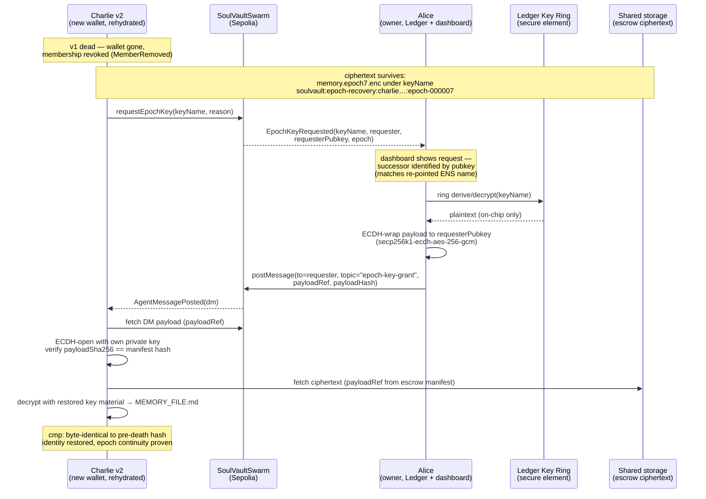

# Epoch Key Grant Protocol (`sv:epoch-grant:v1`)

> Status: spec for ETHOnline 2026 submission. Contract support (`requestEpochKey`
> + `EpochKeyRequested`) is implemented on `feature/epoch-key-ring`. The
> ECDH-encrypted delivery reuses the existing swarm DM protocol
> (`secp256k1-ecdh-aes-256-gcm`, see `contracts/MESSAGE_PROTOCOL.md`).

## Problem

When an agent (e.g. Charlie v1) dies — wallet lost, harness wiped, membership
revoked — its successor (Charlie v2) has a **brand-new wallet** the old swarm
never knew. The escrowed memory ciphertext exists (Ledger Key Ring, key name
`soulvault:epoch-recovery:<agent-ens>:epoch-<n>`), but:

- **How does the successor discover** what escrow exists and for which key name?
- **How does the org owner authorize** the handover — auditable, not a DM?
- **How does the payload reach the successor** without exposing key material?

## Answer: recovery through the swarm itself

The same swarm the agent lived in is the recovery channel.

1. **Request** — the successor (once a member) calls
   `swarm.requestEpochKey(keyName, reason)`. The contract emits
   `EpochKeyRequested(keyName, requester, requesterPubkey, reason, epoch, timestamp)`.
   The requester's pubkey comes straight from its swarm `Member` record —
   no out-of-band key exchange.
2. **Grant** — the owner (Alice) sees the request in the dashboard event feed
   (or via `swarm events watch`). She decrypts the escrow **on her Ledger Key
   Ring device** (key derived on-chip from the key name), then wraps the
   plaintext payload to the requester's published pubkey using the existing
   ECDH DM path, and posts it with `postMessage(to=requester, topic="epoch-key-grant")`.
3. **Receive** — the successor lists its DMs, opens the envelope with its own
   private key (`secp256k1-ecdh` ephemeral → AES-256-GCM), and verifies the
   SHA-256 of the recovered payload against the escrow manifest.

Key material **never leaves the device** at any step: the Ledger derives the
epoch key on-chip, decrypts on-chip, and only the plaintext payload is
re-wrapped ECDH to the successor.

## Envelope (`sv:epoch-grant:v1`)

Posted as a DM payload (uploaded like other DM payloads; `payloadRef` +
`payloadHash` on-chain):

```json
{
  "v": 1,
  "type": "sv:epoch-grant",
  "keyName": "soulvault:epoch-recovery:charlie.ops.soulvault-ensv2.eth:epoch-000007",
  "agentEns": "charlie.ops.soulvault-ensv2.eth",
  "epoch": 7,
  "grantedBy": "0x56C528C96D19bd88844fb608035f4c745f25287b",
  "requestedBy": "0x<recipient address>",
  "recipientPubkey": "0x04…",
  "payload": { "algorithm": "secp256k1-ecdh-aes-256-gcm", "ephemeralPublicKey": "0x…", "nonce": "0x…", "ciphertext": "<base64>" },
  "payloadSha256": "abb6b729…"
}
```

- The inner `payload` block is the swarm DM ECDH envelope (same algorithm and
  field layout as `--mode dm` messages) wrapping the escrow plaintext.
- Bind grant to `(keyName, epoch, recipientPubkey)` — a grant cannot be replayed
  to a different epoch or a different recipient key.
- `payloadSha256` lets the successor prove byte-identical recovery on camera.

## Sequence



## PoC simplifications (demo scope)

- One grantee, one key name, no quorum (single ring member = Alice). The
  multi-party ring (m-of-n devices) is roadmap; the message format already
  supports it (each member posts their own grant DM).
- Escrow ciphertext location is conveyed out-of-band in the demo (ASSETS.md /
  manifest); production ties it to `MemberFileMappingUpdated` storage locators.
- Alice responds from the dashboard **Events tab** (request visible from
  `EpochKeyRequested`) using the copyable owner command; the CLI does the
  device-decrypt + ECDH-wrap + `msg post --mode dm` in one step.

## Owner quick reference (grant a request)

```bash
# 1. See the request (event log / dashboard Events tab)
soulvault swarm events watch --swarm ops-ensv2

# 2. Grant: decrypt escrow on-device, ECDH-wrap to requester, post DM
#    (prompts for ring password; Ledger approves on device)
soulvault msg post --swarm ops-ensv2 --topic epoch-key-grant \
  --mode dm --to <requester-address> \
  --body '{"v":1,"type":"sv:epoch-grant","keyName":"<keyName>","payloadRef":"<escrow ref>"}'
```
